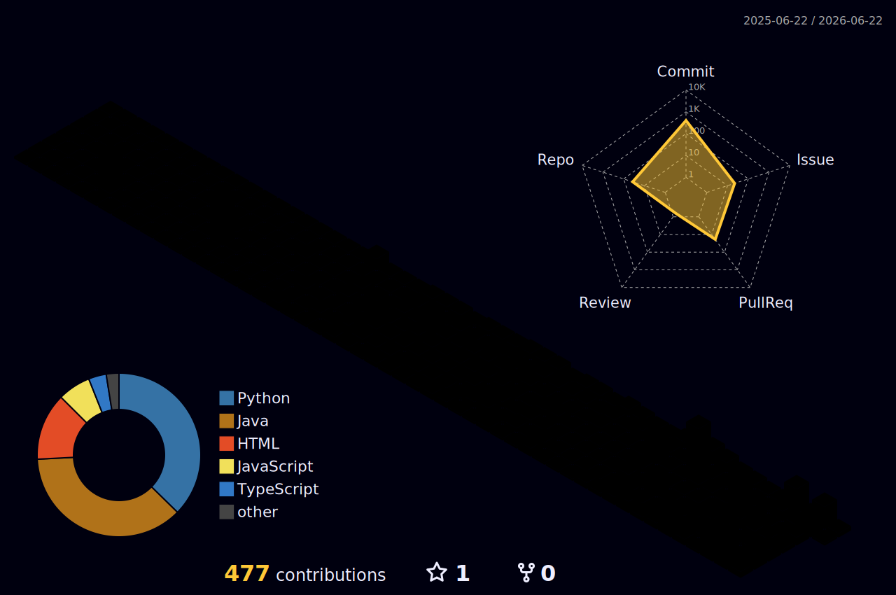

<div align="center">

<!-- ════════════ ANIMATED VENOM HEADER ════════════ -->


<!-- ════════════ TYPING ANIMATION ════════════ -->
<a href="https://git.io/typing-svg">
  
</a>

<br/>

<!-- ════════════ BADGES ════════════ -->

<a href="https://linkedin.com/in/shyambaranwal"></a>
<a href="https://github.com/shyam-medh"></a>
<a href="mailto:baranwal07shyam@gmail.com"></a>
<a href="https://www.hackerrank.com/profile/shyam_medh"></a>
<a href="https://leetcode.com/u/shyam-medh"></a>
<a href="https://codolio.com/profile/Shyam_"></a>

<br/><br/>


</div>

---

## 🧠 About Me

```python
class ShyamBaranwal:
    def __init__(self):
        self.name         = ["Shyam Baranwal"]
        self.role         = ["Ex Python Developer Intern @ Zapuza Technology"]
        self.location     = ["Phagwara, Punjab, India 🇮🇳"]
        self.expertise    = ["Backend Development", "DevOps & CI/CD", "Cloud Architecture"]
        self.currently    = ["Learning and Building and Deploying Projects... ⚙️"]
        self.ask_me_about = ["Java", "Docker", "K8s", "Jenkins", "AWS", "Django", "DSA"]
        self.fun_fact     = ["Solved 800+ DSA problems & still debug with print() 😄"]
        self.goals_2026   = ["AZ-104 ✅", "AWS Solutions Architect", "Open Source"]

    def say_hi(self):
        print("Thanks for stopping by! Let's build something amazing 🚀")

me = ShyamBaranwal()
me.say_hi()
```

---

## 🧰 Tech Stack

<div align="center">

**Languages**


**Frameworks & Backend**


**DevOps & Cloud**


**AWS Services**


**Databases & Tools**


</div>

---

## 📊 3D Contribution Graph

<div align="center">

<picture>
  <source media="(prefers-color-scheme: dark)"  srcset="./profile-3d-contrib/profile-night-rainbow.svg"/>
  <source media="(prefers-color-scheme: light)" srcset="./profile-3d-contrib/profile-south-season-animate.svg"/>
  
</picture>

</div>

---

## 📈 GitHub Stats

<div align="center">


<br/><br/>

[](https://git.io/streak-stats)

</div>
---

## 🌐 Activity Graph

<div align="center">

[](https://github.com/ashutosh00710/github-readme-activity-graph)

</div>

---

## 🐍 Contribution Snake

<div align="center">

<picture>
  <source media="(prefers-color-scheme: dark)"  srcset="https://raw.githubusercontent.com/shyam-medh/shyam-medh/output/github-snake-dark.svg"/>
  <source media="(prefers-color-scheme: light)" srcset="https://raw.githubusercontent.com/shyam-medh/shyam-medh/output/github-snake.svg"/>
  
</picture>

</div>

---

## 🐛 Issues

<div align="center">


</div>

<!-- ISSUES_START -->
> Last updated: **Jun 13, 2026 16:16 UTC** &nbsp;|&nbsp; Assigned: **17** &nbsp;|&nbsp; Raised: **22**

<details>
<summary><b>Assigned Issues</b> · Total: <b>17</b> · Showing latest <b>10</b></summary>

| # | Repository | Title | Labels | Status | Updated |
|---|-----------|-------|--------|--------|---------|
| [#7743](https://github.com/SAPTARSHI-coder/EaseMotion-css/issues/7743) | `SAPTARSHI-coder/EaseMotion-css` | [[FEATURE]  Holographic 3D Pricing Cards](https://github.com/SAPTARSHI-coder/EaseMotion-css/issues/7743) |    | 🟢 `OPEN` | Jun 13, 2026 |
| [#7736](https://github.com/SAPTARSHI-coder/EaseMotion-css/issues/7736) | `SAPTARSHI-coder/EaseMotion-css` | [[FEATURE] MacOS Liquid Hover Dock](https://github.com/SAPTARSHI-coder/EaseMotion-css/issues/7736) |    | 🔴 `CLOSED` | Jun 13, 2026 |
| [#7704](https://github.com/SAPTARSHI-coder/EaseMotion-css/issues/7704) | `SAPTARSHI-coder/EaseMotion-css` | [[FEATURE] Futuristic AI Prompt Input Component](https://github.com/SAPTARSHI-coder/EaseMotion-css/issues/7704) |    | 🔴 `CLOSED` | Jun 13, 2026 |
| [#4521](https://github.com/SAPTARSHI-coder/EaseMotion-css/issues/4521) | `SAPTARSHI-coder/EaseMotion-css` | [[BUG] : Missing Custom 404 Page for Invalid Routes](https://github.com/SAPTARSHI-coder/EaseMotion-css/issues/4521) |    | 🟢 `OPEN` | Jun 13, 2026 |
| [#1221](https://github.com/magic-peach/reframe/issues/1221) | `magic-peach/reframe` | [[FEATURE]: Multi-Segment Trimming — Cut Unwanted Sections...](https://github.com/magic-peach/reframe/issues/1221) |    | 🟢 `OPEN` | Jun 12, 2026 |
| [#1869](https://github.com/recodehive/recode-website/issues/1869) | `recodehive/recode-website` | [💡[Feature]: Optimize Dockerfile for Production with Multi...](https://github.com/recodehive/recode-website/issues/1869) |    | 🟢 `OPEN` | Jun 07, 2026 |
| [#1578](https://github.com/SAPTARSHI-coder/EaseMotion-css/issues/1578) | `SAPTARSHI-coder/EaseMotion-css` | [[FEATURE] Component: Elastic Toggle Switch (CSS-only)](https://github.com/SAPTARSHI-coder/EaseMotion-css/issues/1578) |    | 🔴 `CLOSED` | Jun 06, 2026 |
| [#1579](https://github.com/SAPTARSHI-coder/EaseMotion-css/issues/1579) | `SAPTARSHI-coder/EaseMotion-css` | [[FEATURE] Component: Animated Floating Action Button (FAB...](https://github.com/SAPTARSHI-coder/EaseMotion-css/issues/1579) |    | 🔴 `CLOSED` | Jun 06, 2026 |
| [#1580](https://github.com/SAPTARSHI-coder/EaseMotion-css/issues/1580) | `SAPTARSHI-coder/EaseMotion-css` | [[FEATURE] Animation: Cyberpunk Glitch Text Hover Effect](https://github.com/SAPTARSHI-coder/EaseMotion-css/issues/1580) |    | 🔴 `CLOSED` | Jun 06, 2026 |
| [#1581](https://github.com/SAPTARSHI-coder/EaseMotion-css/issues/1581) | `SAPTARSHI-coder/EaseMotion-css` | [[FEATURE] Component: Bouncing Typing Indicator (Chat Bubble)](https://github.com/SAPTARSHI-coder/EaseMotion-css/issues/1581) |    | 🔴 `CLOSED` | Jun 06, 2026 |

[View all assigned issues](https://github.com/issues/assigned?q=assignee%3Ashyam-medh%20type%3Aissue)

</details>

<details>
<summary><b>Issues Raised By Me</b> · Total: <b>22</b> · Showing latest <b>10</b></summary>

| # | Repository | Title | Labels | Status | Updated |
|---|-----------|-------|--------|--------|---------|
| [#7743](https://github.com/SAPTARSHI-coder/EaseMotion-css/issues/7743) | `SAPTARSHI-coder/EaseMotion-css` | [[FEATURE]  Holographic 3D Pricing Cards](https://github.com/SAPTARSHI-coder/EaseMotion-css/issues/7743) |    | 🟢 `OPEN` | Jun 13, 2026 |
| [#7736](https://github.com/SAPTARSHI-coder/EaseMotion-css/issues/7736) | `SAPTARSHI-coder/EaseMotion-css` | [[FEATURE] MacOS Liquid Hover Dock](https://github.com/SAPTARSHI-coder/EaseMotion-css/issues/7736) |    | 🔴 `CLOSED` | Jun 13, 2026 |
| [#7704](https://github.com/SAPTARSHI-coder/EaseMotion-css/issues/7704) | `SAPTARSHI-coder/EaseMotion-css` | [[FEATURE] Futuristic AI Prompt Input Component](https://github.com/SAPTARSHI-coder/EaseMotion-css/issues/7704) |    | 🔴 `CLOSED` | Jun 13, 2026 |
| [#411](https://github.com/aryandas2911/DailyForge/issues/411) | `aryandas2911/DailyForge` | [Fix Core Bugs in Task and Routine APIs](https://github.com/aryandas2911/DailyForge/issues/411) |    | 🟢 `OPEN` | Jun 13, 2026 |
| [#1221](https://github.com/magic-peach/reframe/issues/1221) | `magic-peach/reframe` | [[FEATURE]: Multi-Segment Trimming — Cut Unwanted Sections...](https://github.com/magic-peach/reframe/issues/1221) |    | 🟢 `OPEN` | Jun 12, 2026 |
| [#933](https://github.com/JiyaBatra/CODEVIBE-/issues/933) | `JiyaBatra/CODEVIBE-` | [[Feature]: Implement Animated Skeleton Loading States for...](https://github.com/JiyaBatra/CODEVIBE-/issues/933) |  | 🔴 `CLOSED` | Jun 08, 2026 |
| [#1869](https://github.com/recodehive/recode-website/issues/1869) | `recodehive/recode-website` | [💡[Feature]: Optimize Dockerfile for Production with Multi...](https://github.com/recodehive/recode-website/issues/1869) |    | 🟢 `OPEN` | Jun 07, 2026 |
| [#1578](https://github.com/SAPTARSHI-coder/EaseMotion-css/issues/1578) | `SAPTARSHI-coder/EaseMotion-css` | [[FEATURE] Component: Elastic Toggle Switch (CSS-only)](https://github.com/SAPTARSHI-coder/EaseMotion-css/issues/1578) |    | 🔴 `CLOSED` | Jun 06, 2026 |
| [#1579](https://github.com/SAPTARSHI-coder/EaseMotion-css/issues/1579) | `SAPTARSHI-coder/EaseMotion-css` | [[FEATURE] Component: Animated Floating Action Button (FAB...](https://github.com/SAPTARSHI-coder/EaseMotion-css/issues/1579) |    | 🔴 `CLOSED` | Jun 06, 2026 |
| [#1580](https://github.com/SAPTARSHI-coder/EaseMotion-css/issues/1580) | `SAPTARSHI-coder/EaseMotion-css` | [[FEATURE] Animation: Cyberpunk Glitch Text Hover Effect](https://github.com/SAPTARSHI-coder/EaseMotion-css/issues/1580) |    | 🔴 `CLOSED` | Jun 06, 2026 |

[View all issues raised by me](https://github.com/search?q=author%3Ashyam-medh%20type%3Aissue&type=issues)

</details>

<!-- ISSUES_END -->

---

## 🔀 Pull Requests

<div align="center">


</div>

<!-- PRS_START -->
> Last updated: **Jun 13, 2026 16:16 UTC** &nbsp;|&nbsp; Total: **19**

<details>
<summary><b>Pull Requests</b> · Total: <b>19</b> · Showing latest <b>10</b></summary>

| # | Repository | Title | Labels | Status | Updated |
|---|-----------|-------|--------|--------|---------|
| [#7768](https://github.com/SAPTARSHI-coder/EaseMotion-css/pull/7768) | `SAPTARSHI-coder/EaseMotion-css` | [feat: add ultimate edition holographic 3d pricing cards c...](https://github.com/SAPTARSHI-coder/EaseMotion-css/pull/7768) |    | 🟣 `MERGED` | Jun 13, 2026 |
| [#7737](https://github.com/SAPTARSHI-coder/EaseMotion-css/pull/7737) | `SAPTARSHI-coder/EaseMotion-css` | [Feature/issue 7736 macos liquid hover dock](https://github.com/SAPTARSHI-coder/EaseMotion-css/pull/7737) |    | 🟣 `MERGED` | Jun 13, 2026 |
| [#1873](https://github.com/recodehive/recode-website/pull/1873) | `recodehive/recode-website` | [feat: optimize Dockerfile for production with multi-stage...](https://github.com/recodehive/recode-website/pull/1873) |    | 🟢 `OPEN` | Jun 13, 2026 |
| [#7733](https://github.com/SAPTARSHI-coder/EaseMotion-css/pull/7733) | `SAPTARSHI-coder/EaseMotion-css` | [feat: add premium AI prompt input component](https://github.com/SAPTARSHI-coder/EaseMotion-css/pull/7733) |    | 🟣 `MERGED` | Jun 13, 2026 |
| [#7697](https://github.com/SAPTARSHI-coder/EaseMotion-css/pull/7697) | `SAPTARSHI-coder/EaseMotion-css` | [fix(docs): add futuristic 404 page and fix responsive hea...](https://github.com/SAPTARSHI-coder/EaseMotion-css/pull/7697) |    | 🔴 `CLOSED` | Jun 13, 2026 |
| [#82](https://github.com/priyanshu5ingh/VISUALAIZE/pull/82) | `priyanshu5ingh/VISUALAIZE` | [Performance & API Optimization (Redis Prompt Caching & AP...](https://github.com/priyanshu5ingh/VISUALAIZE/pull/82) |    | 🟢 `OPEN` | Jun 10, 2026 |
| [#1583](https://github.com/SAPTARSHI-coder/EaseMotion-css/pull/1583) | `SAPTARSHI-coder/EaseMotion-css` | [feat: add elastic toggle switch submission](https://github.com/SAPTARSHI-coder/EaseMotion-css/pull/1583) |    | 🟣 `MERGED` | Jun 06, 2026 |
| [#1699](https://github.com/SAPTARSHI-coder/EaseMotion-css/pull/1699) | `SAPTARSHI-coder/EaseMotion-css` | [feat: add shape-shifting dynamic island fab menu](https://github.com/SAPTARSHI-coder/EaseMotion-css/pull/1699) |    | 🟣 `MERGED` | Jun 06, 2026 |
| [#1708](https://github.com/SAPTARSHI-coder/EaseMotion-css/pull/1708) | `SAPTARSHI-coder/EaseMotion-css` | [feat: add ultimate 3D glitch text collection](https://github.com/SAPTARSHI-coder/EaseMotion-css/pull/1708) |    | 🟣 `MERGED` | Jun 06, 2026 |
| [#1249](https://github.com/magic-peach/reframe/pull/1249) | `magic-peach/reframe` | [feat: add multi-segment trimming (#1221)](https://github.com/magic-peach/reframe/pull/1249) |    | 🟢 `OPEN` | Jun 01, 2026 |

[View all pull requests](https://github.com/search?q=author%3Ashyam-medh%20type%3Apr&type=pullrequests)

</details>

<!-- PRS_END -->

---

## 💼 Work Experience

<div align="center">

&nbsp;

&nbsp;

</div>

<br/>

| Impact                        | Description                                                                           |
| ----------------------------- | ------------------------------------------------------------------------------------- |
| ⚡ **50% faster** lookup      | Built service details + invoice page merging **3+ data sources** into one Django view |
| 📣 **+25% engagement**        | Real-time push notifications via **WebPusher** across 100+ active users               |
| 🔍 **3× faster** retrieval    | Multi-criteria due-task filter **(7+ filters)** using AJAX                            |
| 🐛 **8 critical bugs** caught | Tested attendance module across **15+ edge cases** before deployment                  |

---

## 🏗️ Featured Projects

<table>
<tr>
<td width="50%" valign="top">

### 🔄 DevOps CI/CD Pipeline Automation

> **Django App · Apr 2026** &nbsp; [](https://github.com/shyam-medh/devops-1-django-app)

```
GitHub Push
    ↓
Jenkins Master (AWS EC2)
    ↓
Jenkins Agent → NPM + pip build
    ↓
Docker Multistage Build
    ↓
Django manage.py Tests ✅
    ↓
Docker Compose Deploy 🚀
```

- 🚀 **75%** reduction in deployment time
- ✅ **99.9%** build success rate
- 🔒 **95%** fewer config errors
- 📦 Supports **50+ weekly builds**

`AWS EC2` `Jenkins` `Docker` `CI/CD` `Django` `Linux`

</td>
<td width="50%" valign="top">

### 🎓 Role-Based Student Management System

> **Java · Aug 2025** &nbsp; [](https://github.com/shyam-medh/Library-Management-Sys)

```
Java Swing UI Layer
    ↓
RBAC Middleware
(Admin / Faculty / Student)
    ↓
JDBC Connection Pool
    ↓
MySQL (Indexed + Normalized)
500+ Student Records 🗄️
```

- ⚡ **40%** less manual labor
- 🔒 **30%** fewer data-entry errors
- 📊 Handles **500+** student records
- 🛡️ Full RBAC + session security

`Java Swing` `JDBC` `MySQL` `RBAC`

</td>
</tr>
</table>

---

## 🏆 Certifications

<div align="center">

|                                                     🎖️                                                      | Certification                                           |    Issuer    |   Date   |                                             Link                                              |
| :---------------------------------------------------------------------------------------------------------: | ------------------------------------------------------- | :----------: | :------: | :-------------------------------------------------------------------------------------------: |
|  | **Microsoft Certified: Azure Administrator Associate**  |  Microsoft   | May 2026 | [🔗](https://learn.microsoft.com/en-us/users/shyambaranwal-1125/credentials/86bf1679744cfc9f) |
|     | **Software Engineer Intern Certification**              |  HackerRank  | Mar 2026 |                  [🔗](https://www.hackerrank.com/certificates/1e81101b758b)                   |
|             | **AWS Academy Graduate – Cloud Architecting**           |    Credly    | Jan 2026 |  [🔗](https://www.credly.com/badges/d6ea1d52-73c4-4fa6-b7a1-b598be85b4c7/linked_in_profile)   |
|        | **6-Week AWS Cloud Computing Training**                 | GokBoru Tech | Jul 2025 |         [🔗](https://drive.google.com/file/d/1L3w9homI4UxIJAkaqI07-wkvVzWVYaTR/view)          |
|    | **Prompt Engineering for ChatGPT** _(Vanderbilt Univ.)_ |   Coursera   | Oct 2024 |          [🔗](https://www.coursera.org/account/accomplishments/verify/EGSNQQXF8E64)           |

</div>

---

## 🌟 Achievements

<div align="center">

```
╔══════════════════════════════════════════════════════════════════════╗
║  🌍  Big Code by Google '26 → TOP 1,500 out of 1,50,000+ globally    ║
╠══════════════════════════════════════════════════════════════════════╣
║  💡  800+ Problems Solved  →  LeetCode · HackerRank · Codolio        ║
╠══════════════════════════════════════════════════════════════════════╣
║  ⭐  HackerRank Ratings: 5-Star Java  ·  3-Star Python               ║
╚══════════════════════════════════════════════════════════════════════╝
```

</div>

## 🌟 GSSoC '26

<div align="center">

<a href="https://gssoc.girlscript.org/profile/5fbedb80-8027-48e2-b0ae-26c9d96f735c">
  
</a>
<a href="https://gssoc.girlscript.org/profile/5fbedb80-8027-48e2-b0ae-26c9d96f735c">
  
</a>
<a href="https://gssoc.girlscript.org/profile/5fbedb80-8027-48e2-b0ae-26c9d96f735c">
  
</a>

</div>

| Metric | Value |
| ------ | ----- |
| Role | **Contributor** |
| Status | **Accepted** |
| Track | **Open Source Track + AI / Agents Track** |
| Total Points | **4,537** |
| Global Rank | **#506 / 43,586** |
| Merged PRs | **7** across **4** projects |
| Bounty Tasks | **5** completed |

<details>
<summary><b>Point Distribution</b></summary>

| Source | Points | Notes |
| ------ | -----: | ----- |
| Community Bounties | **650** | Follow X/Twitter, Follow Instagram, Share on LinkedIn, Subscribe to newsletter, AI idea submission |
| Merged Pull Requests | **792** | 7 scored PRs |
| Profile, role, and program milestones | **3,095** | Selection/profile/program scoring from GSSoC |
| **Total** | **4,537** | Current public profile score |

</details>

<details>
<summary><b>Scored Pull Requests</b></summary>

| Project | PR | Level | Points |
| ------- | -- | ----- | -----: |
| `saptarshi-coder/easemotion-css` | [feat: add elastic toggle switch submission](https://github.com/SAPTARSHI-coder/EaseMotion-css/pull/1583) | Intermediate | **95** |
| `saptarshi-coder/easemotion-css` | [feat: add shape-shifting dynamic island fab menu](https://github.com/SAPTARSHI-coder/EaseMotion-css/pull/1699) | Intermediate | **95** |
| `saptarshi-coder/easemotion-css` | [feat: add ultimate 3D glitch text collection](https://github.com/SAPTARSHI-coder/EaseMotion-css/pull/1708) | Intermediate | **95** |
| `jiyabatra/codevibe-` | [Feature/gamification](https://github.com/JiyaBatra/CODEVIBE-/pull/703) | Advanced · Clean | **126** |
| `ratloopz/sahidawa-india` | [feat(devops): implement production-grade dockerization and nginx orchestration](https://github.com/RatLoopz/sahidawa-india/pull/803) | Advanced · Exceptional | **163** |
| `suhani1234-5/tourease` | [feat(frontend): enhance language translation and UI accessibility](https://github.com/Suhani1234-5/TourEase/pull/300) | Intermediate | **85** |
| `ratloopz/sahidawa-india` | [Feature/admin moderation](https://github.com/RatLoopz/sahidawa-india/pull/141) | Advanced · Exceptional | **133** |

</details>

<details>
<summary><b>Earned Badges</b></summary>

| Badge | Category | Unlock Criteria |
| ----- | -------- | --------------- |
| First Steps | Universal | Applied to GSSoC 2026 |
| Early Bird | Universal | Applied in the first 48 hours |
| Discord Verified | Universal | Connected Discord account |
| Code Warrior | Roles | Accepted as Contributor |
| Point Scorer | Points | 500+ points |
| Rising Star | Points | 1,000+ points |
| Power Contributor | Points | 2,500+ points |
| Bounty Hunter | Bounty | First bounty task |
| Bounty Master | Bounty | Bounty milestone completed |
| Getting Started | Contributions | 5 PRs merged |

</details>

[View Official GSSoC Profile](https://gssoc.girlscript.org/profile/5fbedb80-8027-48e2-b0ae-26c9d96f735c)

---

## 🏆 GitHub Achievements

<p align="center">
  
</p>

---

## 📬 Let's Connect

<div align="center">

<a href="https://linkedin.com/in/shyambaranwal"></a>
&nbsp;
<a href="mailto:baranwal07shyam@gmail.com"></a>
&nbsp;
<a href="https://github.com/shyam-medh"></a>

<br/><br/>

> _"First, solve the problem. Then, write the code."_

<br/>


</div>
